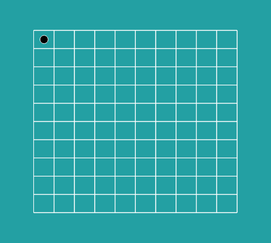
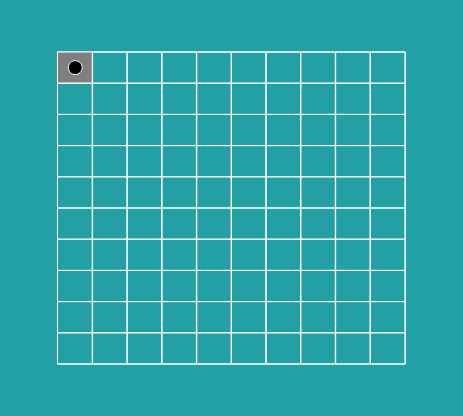
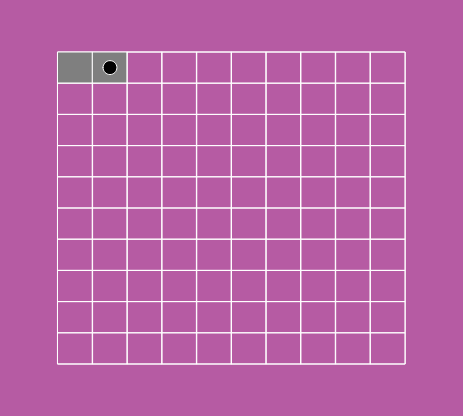
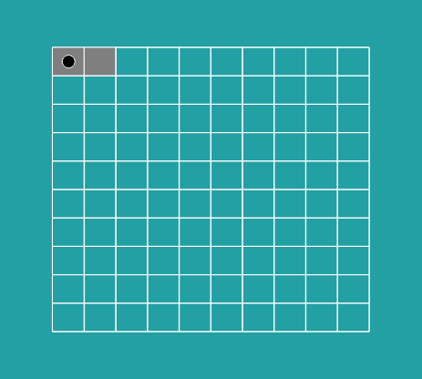
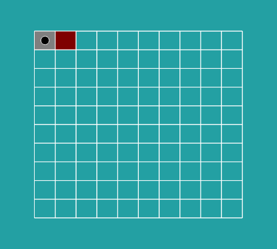
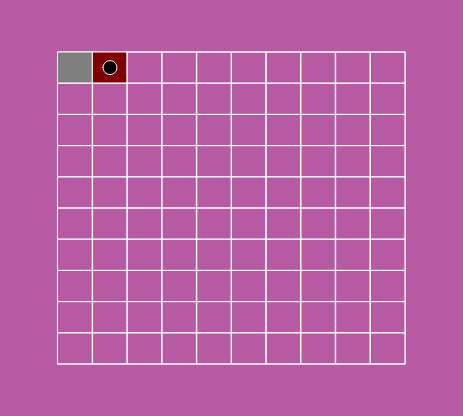

# Example Artwork [WIP]

This is an example artwork demonstrates how to use olta's editions contracts and subgraph api to create dynamic NFT's.

It is intended to use 

The setup uses vite, p5.js and urql, but feel free to use what ever frameworks you desire.

for an overview of olta editions [visit here](TODO :add link)

---

## Setup locally

1. clone repo

   ```
   git clone https://github.com/olta-art/editions-example-artwork.git
   ```

2. install dependencys

   ```
   yarn install
   ```

3. start dev server

   ```
   yarn dev
   ```

4. [visit url with params](http://localhost:3000/?id=1&seed=5&address=0x8f66a247c29a2e4b32da14d94ee96fcae4964370)

## What does this artwork do?
- displays a grid of 100 cells representing 100 editions
- The background color is generated based on the seed
- A black dot is drawn on the cell of the current edition
- the cell of un-minted editions have a transparent background
- the cell of minted editions have a grey background
- the cell of burnt editions have a red background

for example:
|   |   |   |
|---|---|---|
| edition #1 with a seed of 8 looks like: | edition #1, when minted, looks  like: | edition #2, minted with a seed of 33, looks like: |
|  |  |  |
| edition #1, when edition #2 is minted, looks like: | edition #1, with edition #2 burnt, looks like: | edition #2 look like this: |
|  |  |  |

Take a look at `main.js` to see how this is implemented

---


## Helpers
There are four simple helper functions that help to work with olta editions. see main.js for examples of how they can be used.

### getUrlParams()
gets the url parameters using the [URLSearchParams api](https://developer.mozilla.org/en-US/docs/Web/API/URLSearchParams)

Example:

```js
import { getUrlParams } from "./helpers"

const { editionNumber, seed, contractAddress } = getUrlParams()
```

Returns an object with the following:
> | Name | Type | Value |
> |---|---|---|
> | editionNumber | number | between 1 and the edition size |
>
> This is the edition number. When the editions are minted this number is incremented each time. This is useful for querying the editions subgraph to find out infomation specifically about this edition. It can be used to create variation but note the collector will not have any choice and simply get the next edition in the sequence.

> | Name | Type | Value |
> |---|---|---|
> | seed | number | between 1 and the edition size |
>
> **NOTE:** The seed paramerter is only availble in the seeded Editions implementation, this can be chosen by ticking the "seeded" tickbox on the mint form.
>
> Helpful for generating variation between editions, when used with generateSeededRandomness(), see below. The seed is also intened to give collectors choice when minting an edition. When minting you can choose any seed that is available. for example edition #1 can be minted with a seed of 8. Once a seed has been minted it can not be chosen again.

> | Name | Type | Value |
> |---|---|---|
> | contractAddress | string | the address of the edition smart-contract |
>
> Useful for querying the editions subgraph in finding this edition. Each edition series is linked to a specific smart-contract. So combining the edition contract address with the id you can query that specific edition nft. But this also allows you to query for data about the whole edition series.

### seededRandomness(number, seedPhrase*)

takes a number, for exmple the seed, and an optional phrase

example:
```js
import { generateSeededRandomness } from "./helpers"

const rand = generateSeededRandomness(5)

rand() // outputs 0.1
rand() // outputs 0.5
rand() // outputs 0.9
```

### fetchQuery(editionsAddress)
TODO: explain function

### createDummyData(isSeeded)
TODO: create dummy data function that can mint, transfer, and burn artworks
used to easily simulate data from the api without having to change stuff on the blockchain.

---

# Deploy

[look here](https://vitejs.dev/guide/static-deploy.html#surge)

for the easiest go with surge
if you a comftable with git / github you can go with vercel or heroku