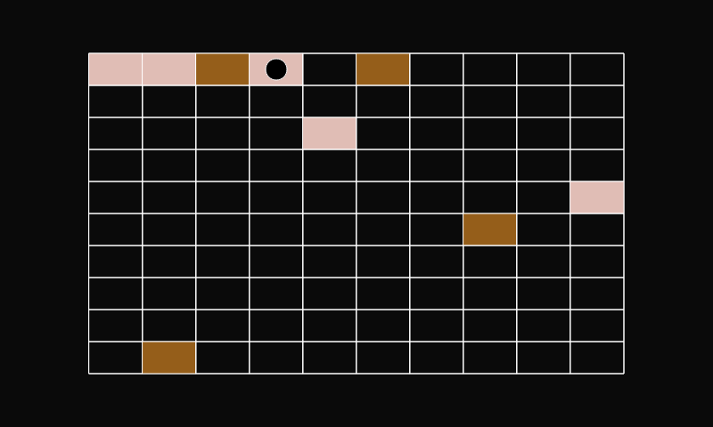

# Example Artwork [WIP]

This is an example artwork demonstrates how to use olta's seeded editions contracts and subgraph api to create dynamic NFT's.

 

## What does this artwork do?
- Displays a grid of 100 squares representing 100 editions
- Each edition is represesnted by a square
- A black dot represents the current edition
- un-minted editions have a transparent background
- minted editions have a background color generated from owner address
- burnt editions have a background color of red

---

## Setup locally

1. clone repo

   ```
   git clone https://github.com/olta-art/editions-example-artwork.git
   ```

2. install dependencys

   ```
   yarn install
   ```

3. start dev server

   ```
   yarn dev
   ```

4. visit url with params: [http://localhost:3000/?id=1&seed=5&address=0x660791e6cdb112fc5246bd594a0adb7c2c2586da](http://localhost:3000/?id=1&seed=5&address=0x660791e6cdb112fc5246bd594a0adb7c2c2586da)


Take a look at `main.js` to see how this is implemented

---


## Helpers
There are four helper functions that you can use to help you work with olta editions: getUrlParams, seededRandomness and fetchTokens
each one is explained below and see main.js for examples of how they can be used.

## getUrlParams()
When an edition is minted it's url contains specfic data about the edition. To access that data in the artwork we can use getUrlParams().
It simply gets the url parameters using the [URLSearchParams api](https://developer.mozilla.org/en-US/docs/Web/API/URLSearchParams)

Example:

```js
import { getUrlParams } from "./helpers"

const { editionNumber, seed, contractAddress } = getUrlParams()
```

Returns an object with the following:

| Name | Type | Value |
|---|---|---|
| editionNumber | number | between 1 and the edition size |
| seed | number or null | between 1 and the edition size |
| contractAddress | string | the address of the edition smart-contract |

The editionNumber parameter is useful for querying the Olta subgraph to relate specific blockchain data back to each edition. see subgraph.js fetchToken() for example query.

The seed is helpful for generating variation between editions. Collectors have the ability to purchase any specific seed if still available. Note, this is only availble in the seeded implementation, this can be chosen by ticking the "seeded" tickbox on the mint form. Will return null if not seeded.

The contractAddress is useful for querying the editions subgraph. Each edition series is linked to a specific smart-contract. see subgraph.js fetchTokenContract() for an example

## seededRandomness(seed, seedPhrase*)

Takes a seed and an optional seedPhrase and returns a funciton that acts similary to [Math.random()](https://developer.mozilla.org/en-US/docs/Web/JavaScript/Reference/Global_Objects/Math/random) but is determanistic.

The seed can be a number or string. The same seed will result in the same sequence of random numbers. The optional seedPhrase is used to offset the sequence.

example:
```js
import { generateSeededRandomness } from "./helpers"

const seededRandom = generateSeededRandomness(5)

seededRandom() // 1st time will always output 0.1
seededRandom() // 2nd time will always output 0.5
seededRandom() // 3nd time will always output 0.9

// ... and so on.
```

In this artwork it is used to generate the color for the squares by parsing in the owner address of the edition.

### fetchTokens(contractAddress)

fetchTokens makes a graphql request to the editions subgraph and returns data on all of the minted tokens for that perticular contract address. We get the contract address by using the getUrlParams() function

For more examples of querys see /helpers/subgraph.js
To explore the subgraph api: [api.thegraph.com/subgraphs/name/olta-art/olta-editions-mumbai/graphql](https://api.thegraph.com/subgraphs/name/olta-art/olta-editions-mumbai/graphql)

---

# Deploy

[look here](https://vitejs.dev/guide/static-deploy.html#surge)

for the easiest go with surge
if you a comftable with git / github you can go with vercel or heroku

# Mint

note down the deployment url and head over to


# Dive deeper

The source code for the contracts can be found here:
Editions
Auction

The source code for the subgraph can be found here
Editions Subgraph